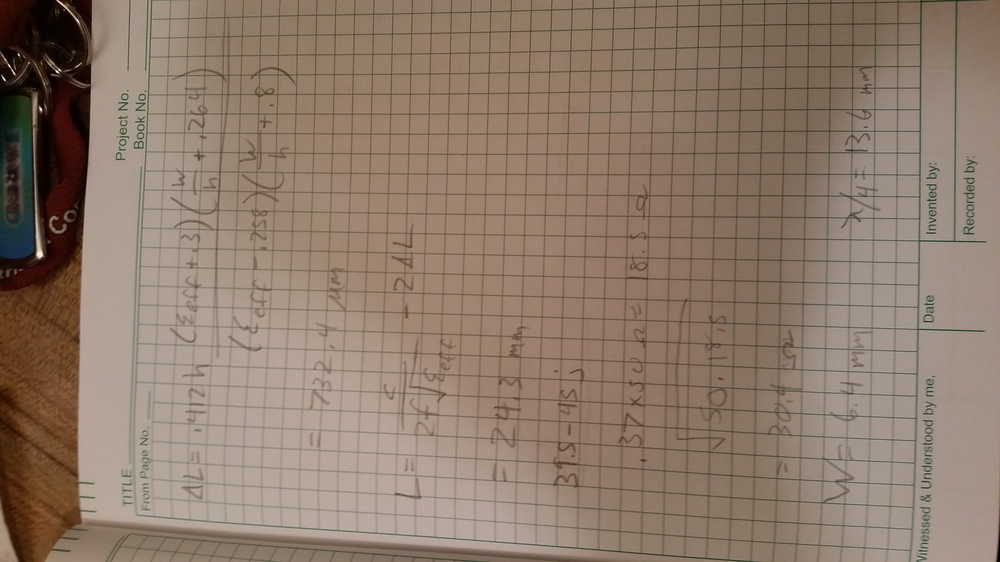
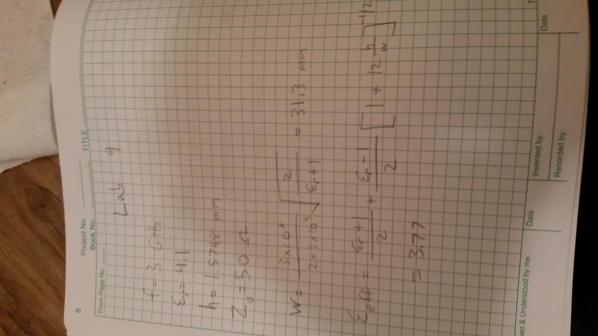

# Lab 9 Report
Jared Pocock

## Background
The device made in this lab is the patch antenna. To help with the design, David supplied us with the design equations needed. In addition to the patch antenna, a quarter wave transformer (QWT) was also made to impedance match the antenna.

## Design
Using the designs given to us at the beginning of the lab, we found the length and width needed to make the patch resonant for the required frequency. The calculations are given in the following photos. 

  

I can't figure out how to rotate the images.
## Procedure
The first part of the procedure was to simply to solder the connector onto the board. The next step was to add the 50 ohm feed line to the board. After that, using the dimensions that were found using the equations, the patch antenna was added to the board. After measuring what the impedance of the antenna was, the QWT was calculated and placed onto the feed line of the antenna. The system was then measured again to see how well it was impedance matched. 

## Results and Discussion
From the results, the results were pretty close to the mark. Even being unmatched, the VSWR was still at its lowest around the 3 GHz mark. When the antenna was matched, again the VSWR was still at its best at the 3 GHz mark which is what was wanted and expected.

With the HFSS file, the patch antenna had to be modified slightly to resonate at 3 GHz. The length had to be reduce to 24 mm to get the proper signal.

## Conclusion
Summarize the key points in the design and results. Also mention unexpected challenges (if any) in the design and how you overcame them. 

## Hindsight
Comment on anything you know now, having completed the lab, that you wish you knew at the beginning of the lab.

## Reflection
Breifly describe the most challenging parts of the lab and the most rewarding parts of the lab.
